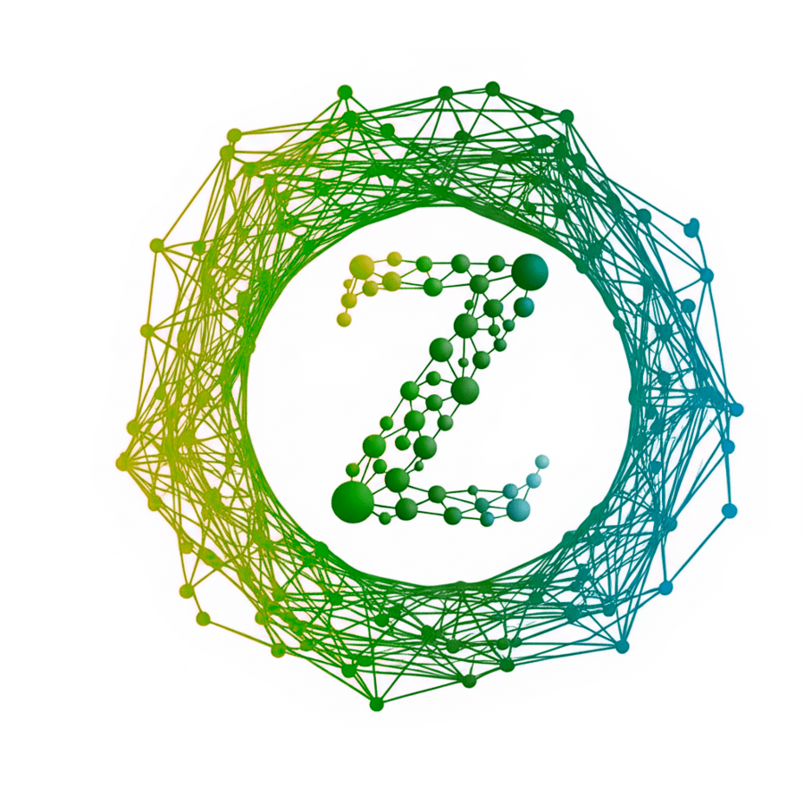
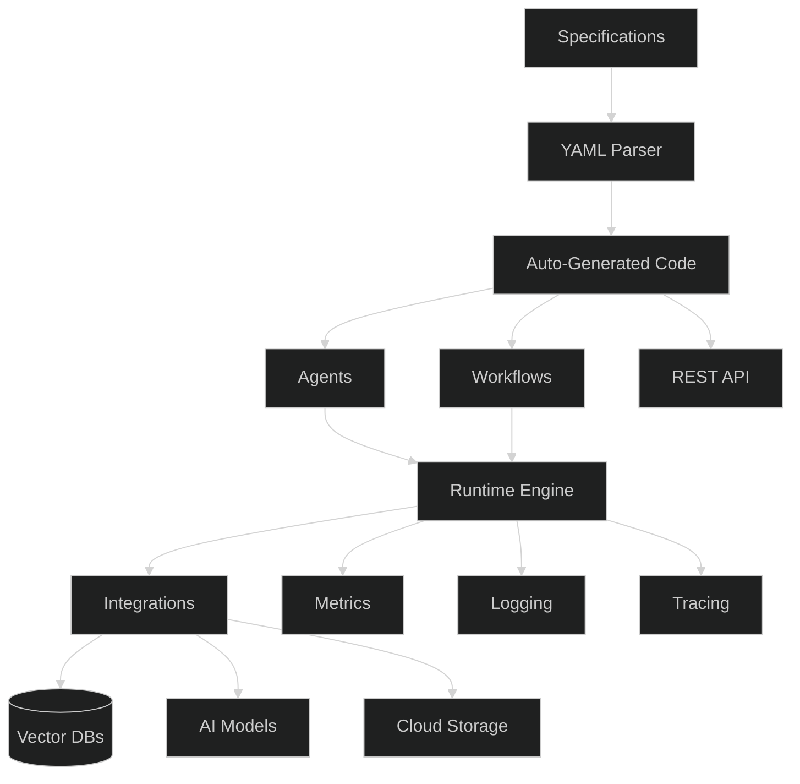

<div align="left" style="margin-top: 50px; margin-bottom: 50px;">
  <div style="display: flex; align-items: center; justify-content: left;">
    
    <div style="width: 100%;">
      <h1>Zimagi</h1>
      <h3>Intelligent Multi-Agent Orchestration and Data Integration Platform</h3>
    </div>
  </div>
</div>

[](https://opensource.org/licenses/Apache-2.0)
[](https://pypi.org/project/zimagi/)
[](https://github.com/zimagi/zimagi/actions)
[](https://docs.zimagi.com)

<div style="margin-top: 50px; margin-bottom: 50px;"/>

## Why Choose Zimagi?

Build collaborative AI systems faster and more reliably with Zimagi. Our open-source platform combines:

- **Agent Collaboration**: AI agents that work together using shared memory
- **Declarative Configuration**: Define complex behaviors with simple YAML
- **Auto-Generated APIs**: Instant REST endpoints from specifications
- **Cloud-Native Design**: Production-ready Docker/Kubernetes support
- **Extensible Ecosystem**: Plugins for custom processors and AI providers

## Design Philosophy

At Zimagi's core is a meta-programming engine that generates code from specifications:

- **Agent Generation**: Define capabilities in YAML → executable Python classes
- **Command Automation**: Describe CLI interfaces, not implementations
- **API Synthesis**: Transform models → REST endpoints automatically
- **Orchestration Abstraction**: Describe systems → Kubernetes manifests

## Features

- **🧠 Intelligent Agents**: Collaborative units with shared state/memory
- **📝 Specification-Driven**: Define in YAML → auto-generate executables
- **🗣️ Multi-Agent Systems**: Agents communicate via sensory channels
- **🚀 Cloud-Native**: Kubernetes-native deployments
- **🔐 RBAC Security**: Granular permissions system
- **⚡️ AI-Powered Workflows**: Combine LLMs, transformers, vector DBs
- **🌐 Auto-Generated APIs**: REST endpoints from specs
- **🧩 Extensible Plugins**: Custom processors & AI integrations

## Project Status

Zimagi is in **Beta** (active development):

- 🏗️ Enhancing agent collaboration patterns
- 🌱 Expanding plugin ecosystem
- ⚙️ Improving Kubernetes operator
- 🔌 Adding vector DB support
- 🚧 Roadmap: [docs.zimagi.com/roadmap](https://docs.zimagi.com/roadmap)

## Installation

```bash
# Quick install
pip install zimagi

# OR with Docker
docker pull zimagi/zimagi:latest
```

## Quick Start

```bash
# Create chatbot project
zimagi init my-chatbot --template=chatbot
cd my-chatbot
zimagi cluster start --dev

# Dashboard: http://localhost:8000
```

## Detailed Usage

```yaml
# research-agent.yaml
name: research-agent
description: Gathers web information
sensory_channels:
  - input: text
    processor: web-search
workflow:
  - analyze: gpt-4-turbo
  - summarize: claude-3
```

More examples: [docs.zimagi.com/examples](https://docs.zimagi.com/examples)

## Documentation

Full documentation at: [docs.zimagi.com](https://docs.zimagi.com)

- Beginner guides
- API references
- Deployment strategies
- Plugin development
- Example repositories

## Platform Architecture



## Contributing

We ❤️ contributors! Join our open-source community:

```bash
# 1. Fork repo: github.com/zimagi/zimagi
# 2. Clone your fork
git clone git@github.com:your-username/zimagi.git

# 3. Create branch
git checkout -b feat/new-agent-type

# 4. Setup dev environment (requires Docker)
cd docker
./dev_env.sh start

# 5. Make changes then test
./run_tests.sh

# 6. Submit PR!
```

We welcome:

- Developers: Agent integrations
- Researchers: Core algorithms
- Technical Writers: Documentation
- Designers: UI components

See our [Contribution Guide](CONTRIBUTING.md)

## License

Apache 2.0 - see [LICENSE](LICENSE) file

## Support & Community

| Resource        | Description                    | Link                                                     |
| --------------- | ------------------------------ | -------------------------------------------------------- |
| Documentation   | Full platform reference        | [docs.zimagi.com](https://docs.zimagi.com)               |
| GitHub Issues   | Bug reports & feature requests | [Issue Tracker](https://github.com/zimagi/zimagi/issues) |
| Discord         | Real-time discussions          | [Join Chat](https://discord.gg/zimagi)                   |
| Community Forum | Technical Q&A                  | [forum.zimagi.com](https://forum.zimagi.com)             |
| Twitter         | Announcements & updates        | [@zimagidev](https://twitter.com/zimagidev)              |
| YouTube         | Tutorials & demos              | [Watch Videos](https://youtube.com/zimagi)               |
